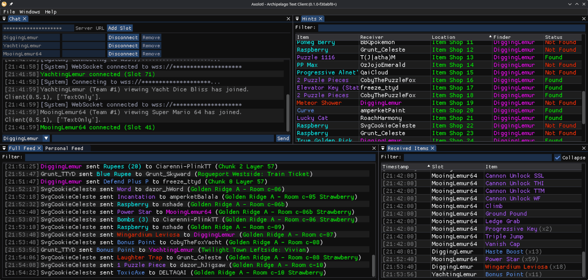

# Axolotl Archipelago Client

Axolotl is a lightweight, cross-platform Archipelago multiworld client built with C++ and ImGui. It provides a clean, modular interface for interacting with Archipelago sessions, including chat, received item tracking, and hinting.



## Features

- **Archipelago Integration**: Attempts to reimplement the functionality of the official Archipelago Text client.
- **Multiple Slot Support**: Connect to multiple slots in one session.
- **Streamer Mode**: Hides server name and port when active.
- **Responsive UI**: A tabbed window system for managing different aspects of your multiworld session:
  - **Chat**: Player chat and connection/status messages.
  - **Item Feed**: Live updates on items received and sent.
  - **Personal Feed**: A filtered feed of items and hints relevant to your connected slot(s).
  - **Hints**: A sortable table of sent and received location hints.
  - **Received Items**: A full list of all items received by your slot(s).
- **Personalization**: UI and content scaling, custom font loading, and searchable font lists.
- **Cross-Platform**: Built to run on Linux and Windows.

## Obtaining

- The latest release can be downloaded from the [releases page](https://github.com/mooinglemur/axolotl/releases).

**The macOS build is not tested, and may not work at all**

## Dependencies

- **CMake** (>= 3.16)
- **C++20 Compiler** (GCC, Clang, or MSVC)
- **GLFW**
- **OpenGL** (or Metal on macOS)
- **Fontconfig** (Linux only)
- **nlohmann_json**
- **yaml-cpp**

## Building

### Prerequisites (Linux)

For Ubuntu/Debian-based systems, you can install the necessary dependencies with:

```bash
sudo apt-get install build-essential cmake libglfw3-dev libfontconfig1-dev libssl-dev
```

### 1. Clone the Repository
Ensure you initialize submodules to fetch ImGui and IXWebSocket.

```bash
git clone https://github.com/mooinglemur/axolotl
cd axolotl
git submodule update --init --recursive
```

### 2. Build with CMake/ninja

```bash
mkdir build && cd build
cmake .. -G Ninja -DCMAKE_BUILD_TYPE=Release
ninja
```

If your system does not have the ninja build system and you don't wish to install it, `make` is also an option.

```bash
mkdir build && cd build
cmake .. -DCMAKE_BUILD_TYPE=Release
make -j$(nproc)
```

## Usage

After building, run the `axolotl-apclient` executable. Enter your Archipelago server address (e.g., `archipelago.gg:38281`), slot name, and password to connect. If you're playing multiple games in the same multiworld, you can connect additional slot names.

- **Selection and Copy**: You can select rows in the Item Feed, Chat, and Lists using standard click. Use `Shift+Click` for range selection.
- **Context Menu**: Right-click on any selected row(s) to copy text to the clipboard (with optional timestamps or formatting).
- **Settings**: Access UI and font scaling via the **File > Settings** menu.

## License

Axolotl is licensed under the [MIT License](LICENSE.txt).
