# Axolotl Archipelago Text Client

## Introduction

### What is Archipelago?

Archipelago is a multiworld randomizer, a framework for synchronizing the progress of multiple games between multiple players.  It officially supports [a few dozen games](https://archipelago.gg/games), and has unofficial support for [many more](https://ap-lobby.bananium.fr/worlds).

### What is Axolotl?

Axolotl is a text client for the Archipelago Multiworld Randomizer.  It is intended to be a lightweight and customizable client for the game, with a focus on simplicity and ease of use with additional features for streamers and players who participate in multiple concurrent games in a single multiworld.  It is written in C++ and uses the [Dear ImGui](https://github.com/ocornut/imgui) framework for the graphical user interface.

### Why the name Axolotl?

Coming up with names for things is one of my weakest points, but I wanted a distinctive but recognizeable name that wasn't already associated with Archipelago, and wasn't already in common use by a similar project.  It also doesn't hurt that axolotls are cute, and that the word is fun to say. :3

### Why did I create Axolotl?

The official Archipelago Text client is a fine client for a typical Archipelago session, but it does not scale well to larger multiworlds.  Chat messages and item messages are interleaved, and it's easy to miss chat messages or important items when the feed is scrolling quickly.

The initial features I wanted were:
* A separated chat and item feed
* The ability to optionally filter the incoming feed to show only your own items

As the project started becoming functional, it made sense to add a few more features:
* Connecting to multiple slots in a single multiworld
* A dedicated hint table
* Custom font support
* Substring search filter for most windows

With an increasing number of users, the feature set is continuing to expand and the project continues to be under active development as of March 2026.

## Features

### Core Client Features
* **Multi-Slot Connectivity**: Connect to multiple slots in the same multiworld within a single client instance.
* **Separated Feed Windows**: Keep chat conversations distinct from item notifications with dedicated window types.
* **Personalized Item Feed**: Toggle between a "Global" feed of all multiworld events and a "Personal" feed showing only items sent to or found by you.
* **Personal Hint Table**: A central, filterable table for hint data for all of your connected slots.
* **Spoiler Sphere Tracker**: Load a spoiler log to visualize the logical progression of your multiworld.  For each of your connected slots, the default view shows the unchecked locations in the earliest sphere that contains unchecked locations. You can also view the sphere-based playthrough for all players.
* **Tracker**: Shows all unchecked locations in your connected slots. Future support is planned for integrated logic to determine which locations are reachable with your current items.
* **Multiworld Overview**: Using the tracker API from the Archipelago server, display real-time statistics showing checked locations, total locations, and games completed across all players.

### Streamer & OBS Integration
* **Streamer Mode**: Avoids accidentally revealing the server name and port number in the UI and status messages when sharing the screen.
* **Embedded Web Server**: Host custom browser-source overlays directly from the client.
* **Real-Time Overlays**:
    * **Item Feed**: A sliding vertical feed of items (similar to the in-game UI) that updates via WebSocket.
    * **Progress Overview**: A dynamic header/footer showing multiworld completion percentages and location counts.
* **Custom Styling**: Overlays are provided with default CSS that can be easily customized via OBS's "Custom CSS" field.

### Technical & UI Highlights
* **Advanced Font Support**: Support for custom TTF/OTF fonts with support for fallback fonts (CJK/Emoji).
* **Flexible UI**: Built on Dear ImGui with a docking-enabled layout that saves your window positions between sessions.
* **Performance Focused**:
    * **DataPackage Caching**: Local caching of game data to minimize networking on startup.
    * **Async Networking**: Non-blocking IO with automatic reconnection and TLS support.
    * **UI Performance**: UI rendering is designed to be polite to the CPU.
* **Cross-Platform**: Native builds available for Linux and Windows, with experimental support for macOS.

## General Usage

The first time Axolotl is run, it will create a configuration file in `~/.config/axolotl/` (Linux) or `%APPDATA%/axolotl/` (Windows).  This file will be updated as you make changes to the settings in the client.

The first time that the application is run, UI will look something like this:

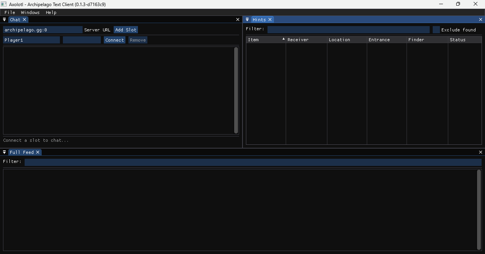

Fill in the server address:port, and the slot name (and password if needed), and click "Connect".

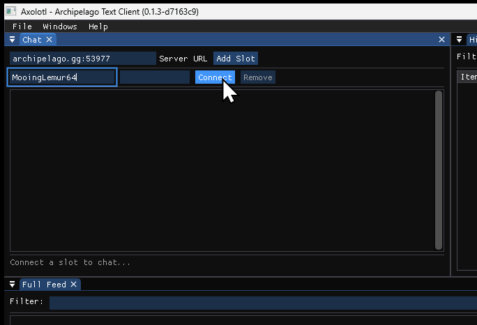

Optionally, if you are connecting to multiple slots in the same multiworld, you can click "Add Slot" to add more slots and connect them.

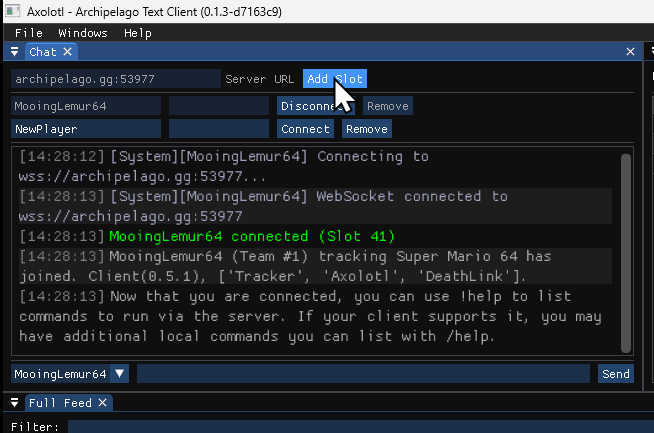
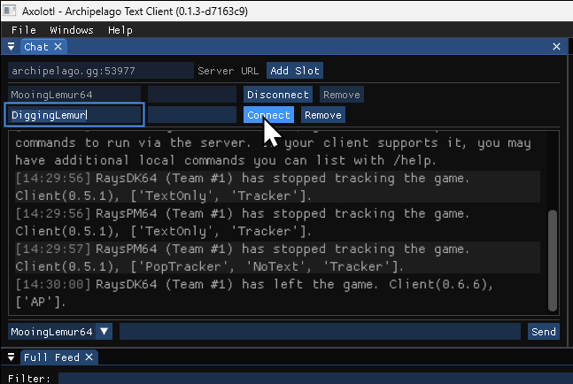

If you are connected to multiple slots, you can change the identity from which you send chat messages.

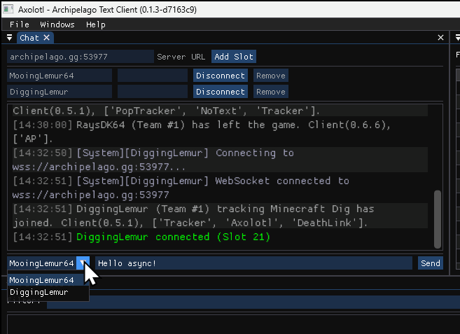

If you are delivered a hint or hints, those will appear in the item feed rather than chat.  They'll also appear in the hints window if they haven't been found at the time the hints were first scouted or requested.

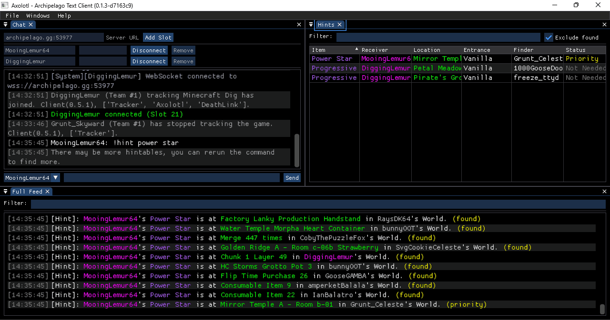

If you'd like to change the status of a hint you have requested, for instance, to indicate to other players that it's no longer needed, you can right-click on the hint status in the hints window to see and choose the available statuses.  Not all other clients will display the updated hint status, though.

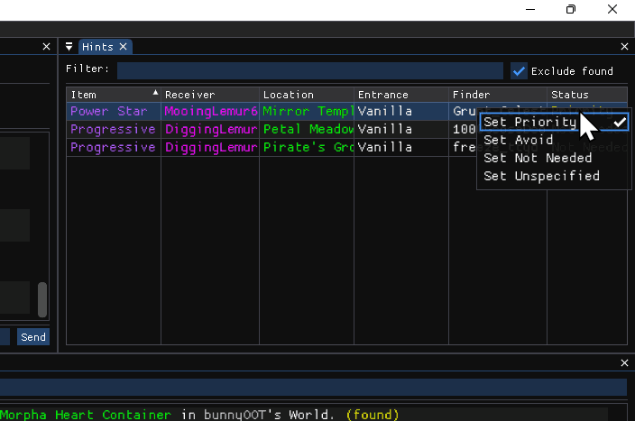

The full feed contains location checks and items for all players.

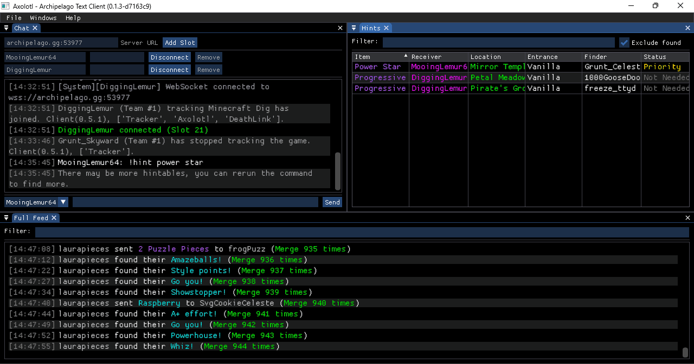

During a large multiworld, it may be more useful to show a feed of only items and hints sent from or received by your connected slots.  For this, there's a separate Personal Feed window that can be opened from the Window menu.

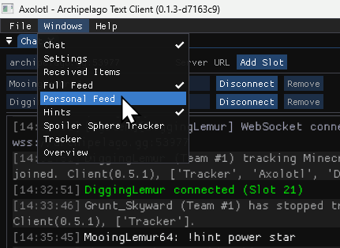

By default, if windows inside Axolotl have not ever been opened before, they spawn floating and undocked.  You can drag a window around to dock it by splitting the region taken by another window, or by adding it as a tab in a current region.  You're encouraged to experiment with the layout!  The layout will be saved when closing the application.

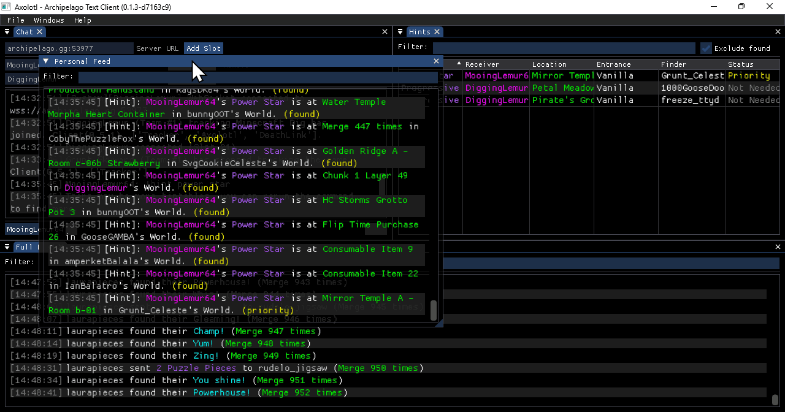
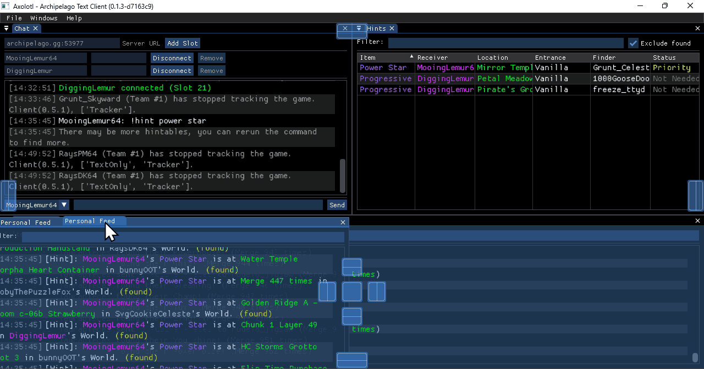
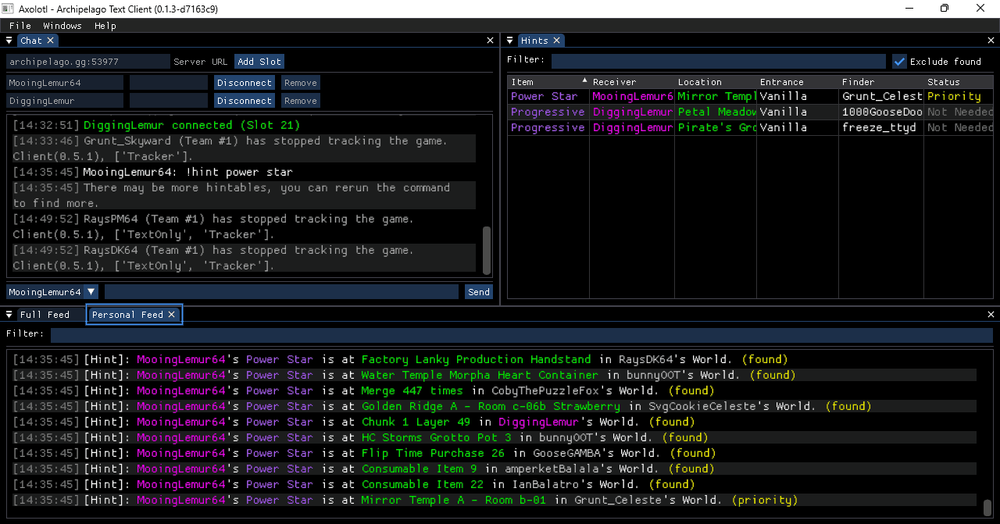

That covers the basics.  There's still a lot of functionality to explore, but this should be enough to get you started.

## Embedded HTTP Server

Axolotl contains an embedded HTTP server that can be used to host custom browser-source overlays for streaming.  The server is **not** enabled by default, but can be enabled in the settings window.  The server is accessible at `127.0.0.1` on port `3621` by default, so all of the URL examples in this documentation will use these values, but if desired, the bind address and port can be changed in the settings window.

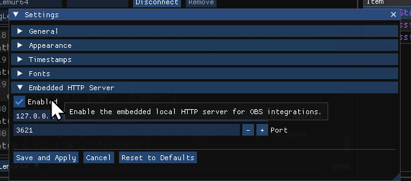

### Feed Browser Source

The feed browser source is served at `/feed`.

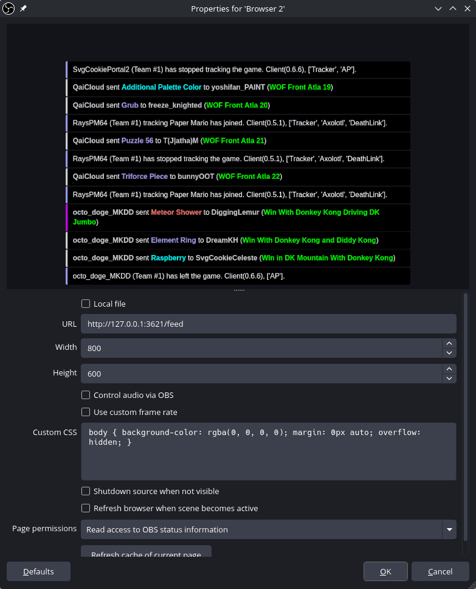

The default feed styling may not be to everyone's liking.  Fortunately, the feed is styled using CSS, so it can be customized by editing the CSS override in OBS.

You can view the stock CSS in a browser at `http://127.0.0.1:3621/feed.css`

Here's an overridden source that uses a different font, tighter spacing, and alternating shaded rows:

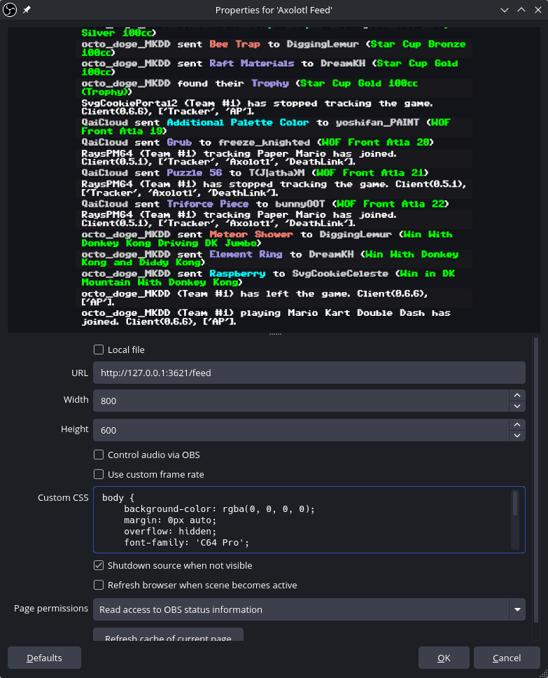

This is the CSS used in the example above:

```css
body {
    background-color: rgba(0, 0, 0, 0);
    margin: 0px auto;
    overflow: hidden;
    font-family: 'C64 Pro';
}

/* Remove the colorful left stripe from all feed items */
.feed-item {
    border-left: none !important;
}

/* Tighten the internal space (padding) and space between items (margin) */
.feed-item {
    padding: 2px 12px !important; /* Reduced from 8px to 2px */
    margin-top: 1px !important;   /* Reduced space between items */
}

/* Optional: Slightly reduce the font size for an extra compact feel */
.feed-text {
    font-size: 14px !important;
    line-height: 1.2 !important;
}

/* Style for every ODD event (1st, 3rd, 5th...) */
.feed-item:nth-child(odd) {
    background-color: rgba(30, 30, 35, 0.75) !important;
}
/* Style for every EVEN event (2nd, 4th, 6th...) */
.feed-item:nth-child(even) {
    background-color: rgba(20, 20, 25, 0.65) !important;
}

/* If you want to enable timestamps, remove the comment before display */
.timestamp {
    /* display: inline-block !important; /* Forces the timestamp to show */
    color: #dddddd;                  /* Subtle gray color */
    font-weight: normal;
    margin-right: 8px;               /* Space between timestamp and message */
}
```

### Overview Browser Source

This is served at `/overview`.

In order for it to display anything useful, you will need to open the Overview window in Axolotl, have the tracker URL (e.g. `https://archipelago.gg/tracker/iduWRXxiRt-geq9LZeP8vw`) filled in (in the Overview window's Tracker URL field), and be connected to at least one slot in the associated multiworld.

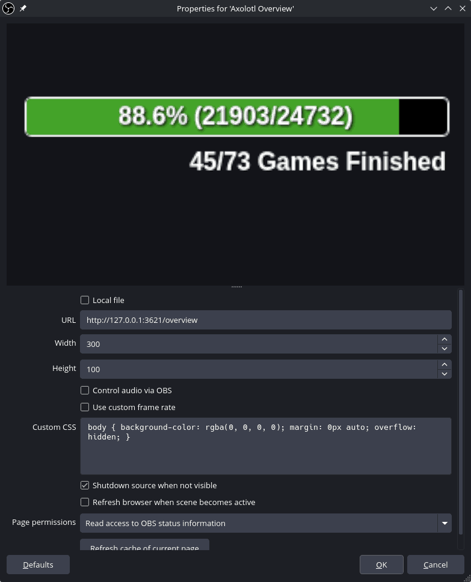

Similar to the item feed source, this source can be styled using CSS.  You can view the stock CSS in a browser at `http://127.0.0.1:3621/overview.css`.

Here are a few examples of CSS with various styling:

**Invert the order of the progress bar and the finished games:**
```css
#games-container { order: 1; }
#progress-container { order: 2; }
```

**Remove the "Games Finished" text but keep the numbers:**
```css
.games-label { display: none; }
```

**Get rid of the progress bar, keep the location counts, and show the games finished (numbers) on a single row**

```css
#progress-container { width: auto; }
#progress-bar-track { display: none; }
#progress-text { position: static; height: auto; justify-content: flex-start; }
#games-text { display: flex; flex-direction: row; gap: 8px; justify-content: flex-start; text-align: left; }
#overview-container { flex-direction: row; justify-content: flex-start;     gap: 20px; padding: 4px 12px; }
.games-label { display: none; }
```
