# Axolotl Archipelago Text Client

## Introduction

### What is Archipelago?

Archipelago is a multiworld randomizer, a framework for synchronizing the progress of multiple games between multiple players.  It officially supports [a few dozen games](https://archipelago.gg/games), and has unofficial support for [many more](https://ap-lobby.bananium.fr/worlds).

### What is Axolotl?

Axolotl is a text client for the Archipelago Multiworld Randomizer.  It is intended to be a lightweight and customizable client for the game, with a focus on simplicity and ease of use with additional features for streamers and players who participate in multiple concurrent games in a single multiworld.  It is written in C++ and uses the [Dear ImGui](https://github.com/ocornut/imgui) framework for the graphical user interface.

### Why the name Axolotl?

Coming up with names for things is one of my weakest points, but I wanted a distinctive but recognizeable name that wasn't already associated with Archipelago, and wasn't already in common use by a similar project.  It also doesn't hurt that axolotls are cute, and that the word is fun to say. :3

### Why did I create Axolotl?

The official Archipelago Text client is a fine client for a typical Archipelago session, but it does not scale well to larger multiworlds.  Chat messages and item messages are interleaved, and it's easy to miss chat messages or important items when the feed is scrolling quickly.

The initial features I wanted were:
* A separated chat and item feed
* The ability to optionally filter the incoming feed to show only your own items

As the project started becoming functional, it made sense to add a few more features:
* Connecting to multiple slots in a single multiworld
* A dedicated hint table
* Custom font support
* Substring search filter for most windows

With an increasing number of users, the feature set is continuing to expand and the project continues to be under active development as of May 2026.

## Features

### Core Client Features
* **Multi-Slot Connectivity**: Connect to multiple slots in the same multiworld within a single client instance.
* **Separated Feed Windows**: Keep chat conversations distinct from item notifications with dedicated window types.
* **Personalized Item Feed**: Toggle between a "Global" feed of all multiworld events and a "Personal" feed showing only items sent to or found by you.
* **Personal Hint Table**: A central, filterable table for hint data for all of your connected slots.
* **Spoiler Sphere Tracker**: Load a spoiler log to visualize the logical progression of your multiworld.  For each of your connected slots, the default view shows the unchecked locations in the earliest sphere that contains unchecked locations. You can also view the sphere-based playthrough for all players.
* **Tracker**: Shows all unchecked locations in your connected slots. Future support is planned for integrated logic to determine which locations are reachable with your current items.
* **Multiworld Overview**: Using the tracker API from the Archipelago server, display real-time statistics showing checked locations, total locations, and games completed across all players.
* **Profiles**: Run multiple independent profiles (settings, window layout, tracker URL, graph history) side by side — useful for participating in more than one Archipelago event simultaneously. Each profile is locked to a single instance; second instances see a profile picker with the option to switch, fork, or take over.

### Streamer & OBS Integration
* **Streamer Mode**: Avoids accidentally revealing the server name and port number in the UI and status messages when sharing the screen.
* **Embedded Web Server**: Host custom browser-source overlays directly from the client.
* **Real-Time Overlays**:
    * **Item Feed**: A sliding vertical feed of items (similar to the in-game UI) that updates via WebSocket.
    * **Progress Overview**: A dynamic header/footer showing multiworld completion percentages and location counts.
    * **Checks Graph**: A line graph of total location checks over time, persisted across restarts.
    * **Stats**: Per-slot progress bars, a rotating "notable players" callout (most ahead / falling behind / most idle / not yet started), and a CSS-only fireworks goal popup.
* **Custom Styling**: Overlays are provided with default CSS that can be easily customized via OBS's "Custom CSS" field.

### Technical & UI Highlights
* **Advanced Font Support**: Support for custom TTF/OTF fonts with support for fallback fonts (CJK/Emoji).
* **Flexible UI**: Built on Dear ImGui with a docking-enabled layout that saves your window positions between sessions.
* **Performance Focused**:
    * **DataPackage Caching**: Local caching of game data to minimize networking on startup.
    * **Async Networking**: Non-blocking IO with automatic reconnection and TLS support.
    * **UI Performance**: UI rendering is designed to be polite to the CPU.
* **Cross-Platform**: Native builds available for Linux and Windows, with experimental support for macOS.

## General Usage

The first time Axolotl is run, it will create a configuration directory under `axolotl-apclient`:

* **Linux**: `$XDG_CONFIG_HOME/axolotl-apclient/` if set, otherwise `~/.config/axolotl-apclient/`
* **Windows**: `%APPDATA%\axolotl-apclient\`
* **macOS**: `~/Library/Application Support/axolotl-apclient/`

Cached data packages and PopTracker packs live alongside, under `axolotl-apclient` in `$XDG_CACHE_HOME` (or `~/.cache/`) on Linux, `%LOCALAPPDATA%\axolotl-apclient\cache\` on Windows, and `~/Library/Caches/axolotl-apclient/` on macOS. The configuration files are updated as you make changes to settings in the client.

The first time that the application is run, UI will look something like this:

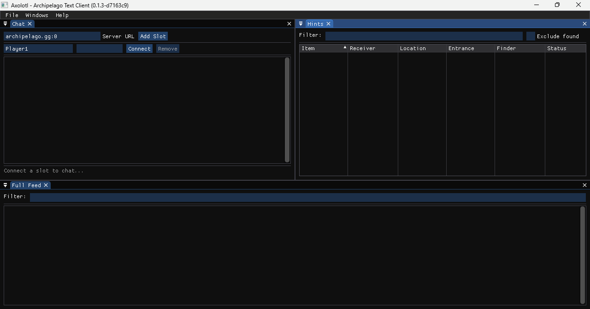

Fill in the server address:port, and the slot name (and password if needed), and click "Connect".

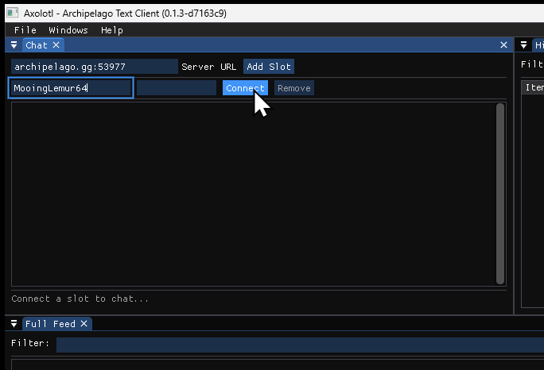

Optionally, if you are connecting to multiple slots in the same multiworld, you can click "Add Slot" to add more slots and connect them.

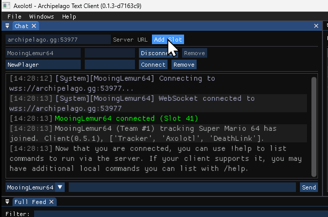
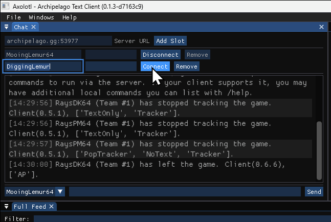

If you are connected to multiple slots, you can change the identity from which you send chat messages.

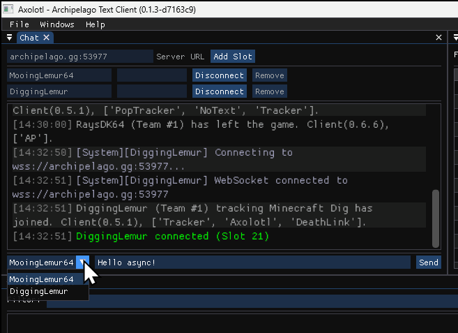

If you are delivered a hint or hints, those will appear in the item feed rather than chat.  They'll also appear in the hints window if they haven't been found at the time the hints were first scouted or requested.

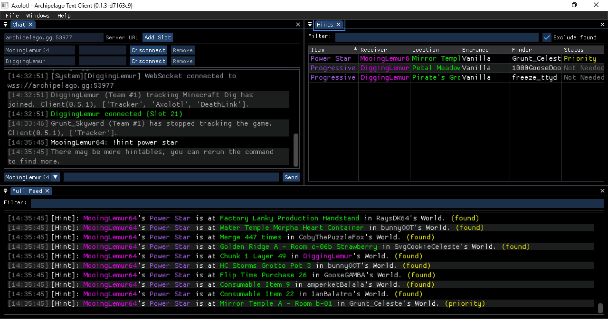

If you'd like to change the status of a hint you have requested, for instance, to indicate to other players that it's no longer needed, you can right-click on the hint status in the hints window to see and choose the available statuses.  Not all other clients will display the updated hint status, though.

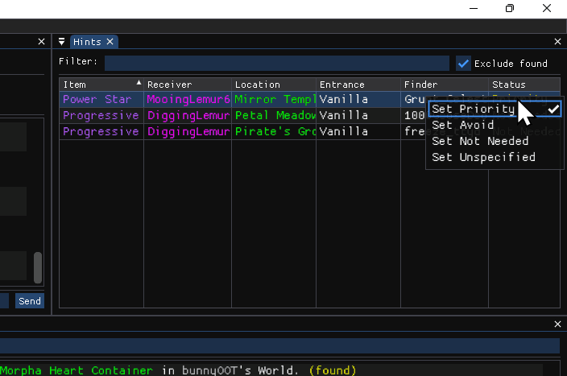

The full feed contains location checks and items for all players.

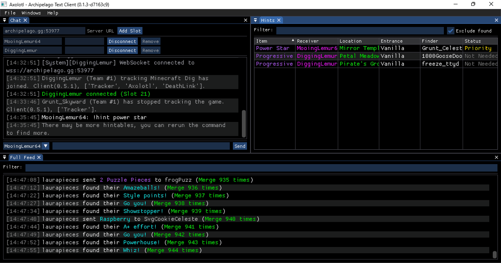

During a large multiworld, it may be more useful to show a feed of only items and hints sent from or received by your connected slots.  For this, there's a separate Personal Feed window that can be opened from the Window menu.

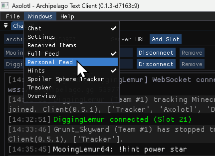

By default, if windows inside Axolotl have not ever been opened before, they spawn floating and undocked.  You can drag a window around to dock it by splitting the region taken by another window, or by adding it as a tab in a current region.  You're encouraged to experiment with the layout!  The layout will be saved when closing the application.

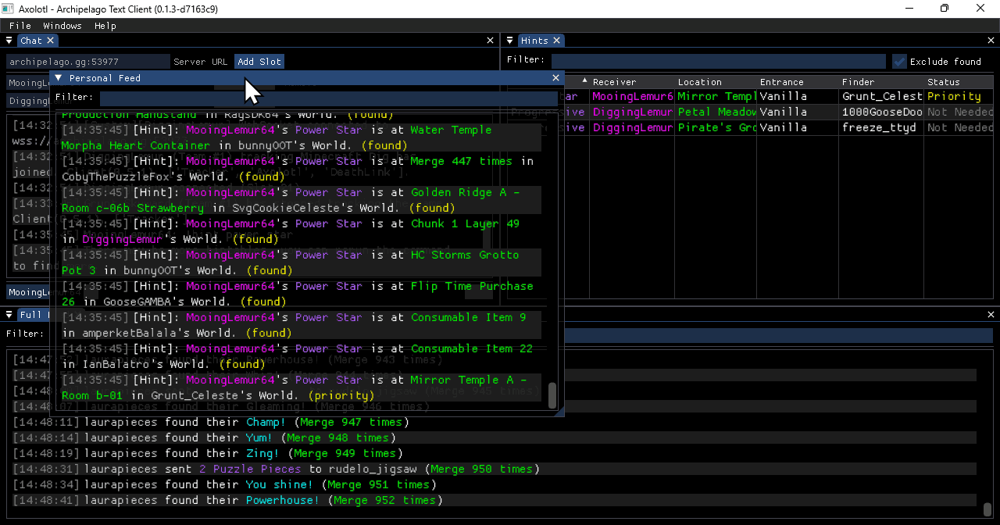
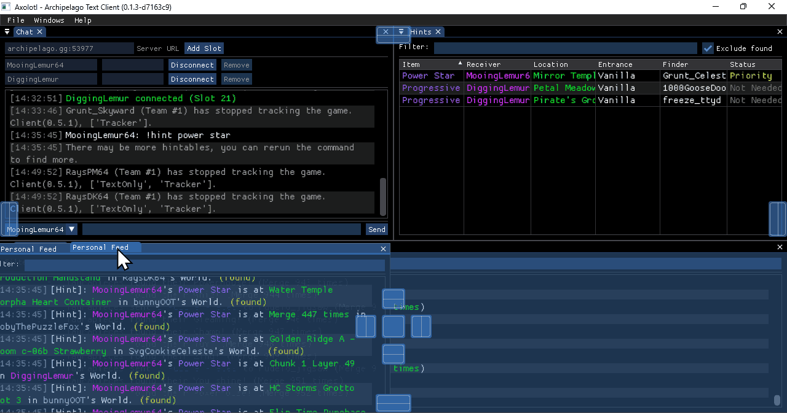
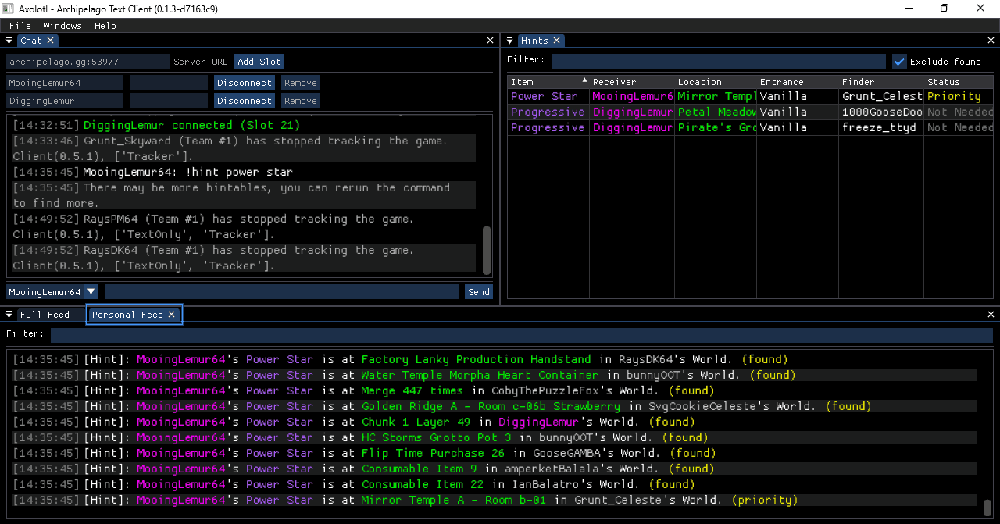

That covers the basics.  There's still a lot of functionality to explore, but this should be enough to get you started.

## Profiles

Axolotl supports multiple independent **profiles**, useful when you're playing in more than one Archipelago event at the same time (multiple asyncs, a sync, etc.). Each profile has its own settings, window layout, tracker URL, and graph history; only caches (data packages and PopTracker packs) are shared.

### Selecting a profile at startup

Pass `--profile=NAME` on the command line to launch into a specific profile. If the profile doesn't exist yet, it's created on first launch. A typical workflow is to make a desktop shortcut per event:

```
axolotl-apclient --profile=summer-async
axolotl-apclient --profile=main-sync
```

Without any flag, Axolotl resumes the **most recently used** profile. On a brand-new install — or right after upgrading from a pre-profile version — that's `default`, since the existing single-profile state is migrated into `profiles/default/` on first launch.

### Two instances at once

Each profile can only be open by one instance at a time. If you launch a second instance pointed at a profile that's already in use, Axolotl shows a profile picker right at startup. From there you can:

- **Open another existing profile** — pick a row and click "Open selected" to switch this instance to that profile.
- **Create a new profile** (forked from the in-use one) and open it directly.
- **Take over** the locked profile — useful if a previous instance crashed without releasing the lock.
- **Quit**.

If a previous instance crashed (the lock owner is no longer alive, or the machine has rebooted), Axolotl detects the stale lock and silently takes over without showing the picker.

### Managing profiles from inside the app

`File → Profiles...` opens the management window. From there you can:

- See all profiles, sorted by most recently used.
- **Create** a new profile, forked from the current one. The fork copies the full `config.yaml` (server URL, slot connections, tracker URL, UI scale, fonts, HTTP server settings, window geometry, all toggles) and `imgui.ini` (window layout). Caches (data packages, PopTracker packs) are shared at the install level. Graph history (`checks_history.json`) is **not** copied, so the new profile starts with an empty checks history.
- **Switch** to another profile. This saves the current profile's state, releases its lock, and re-launches Axolotl in the chosen profile.
- **Delete** a profile (only when it's not currently in use by another instance).

The active profile name appears in the OS window title.

## Embedded HTTP Server

Axolotl contains an embedded HTTP server that can be used to host custom browser-source overlays for streaming.  The server is **not** enabled by default, but can be enabled in the settings window.  The server is accessible at `127.0.0.1` on port `3621` by default, so all of the URL examples in this documentation will use these values, but if desired, the bind address and port can be changed in the settings window.

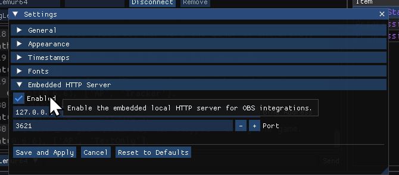

### Feed Browser Source

The feed browser source is served at `/feed`.

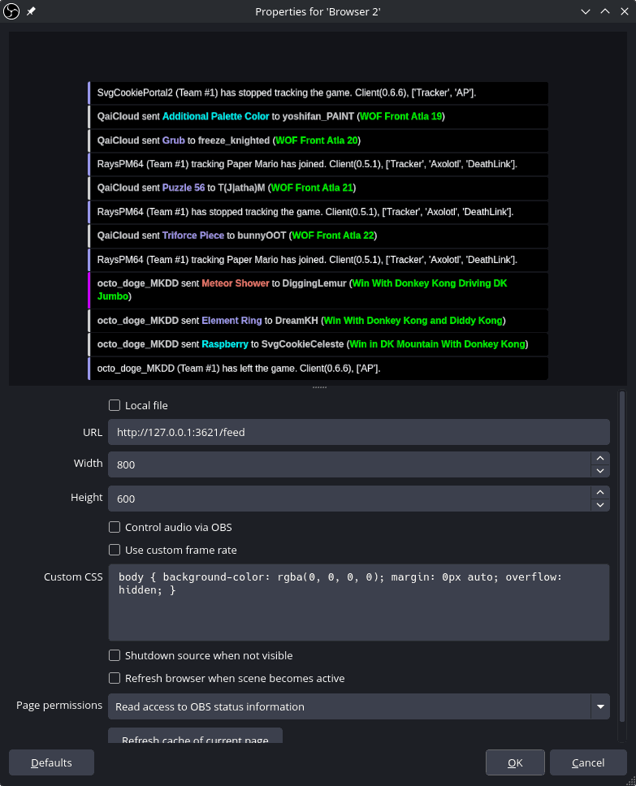

You can add any of the following query parameters to filter the feed by category:

* items
* hints
* chat
* misc

For instance, to only show items and hints, you would use the URL `http://127.0.0.1:3621/feed?items=1&hints=1&chat=0&misc=0`.  The current default if the category is *not* mentioned, it is enabled. The explicitly-enabled ones are shown here mainly for illustrative purposes.

DeathLink events are delivered when *either* `items` or `misc` is enabled, so an item-only feed still shows deaths.  They appear only if **Show DeathLink Messages** is enabled in the settings window; turning that off removes them from the web feed as well.

Additionally, you can exclude filler items from the feed using the `excludefiller` parameter.  For instance, to only show items and hints, you would use the URL `http://127.0.0.1:3621/feed?items=1&hints=1&chat=0&misc=0&excludefiller=1`.

The default feed styling may not be to everyone's liking.  Fortunately, the feed is styled using CSS, so it can be customized by editing the CSS override in OBS.

You can view the stock CSS in a browser at `http://127.0.0.1:3621/feed.css`

Here's an overridden source that uses a different font, tighter spacing, and alternating shaded rows:

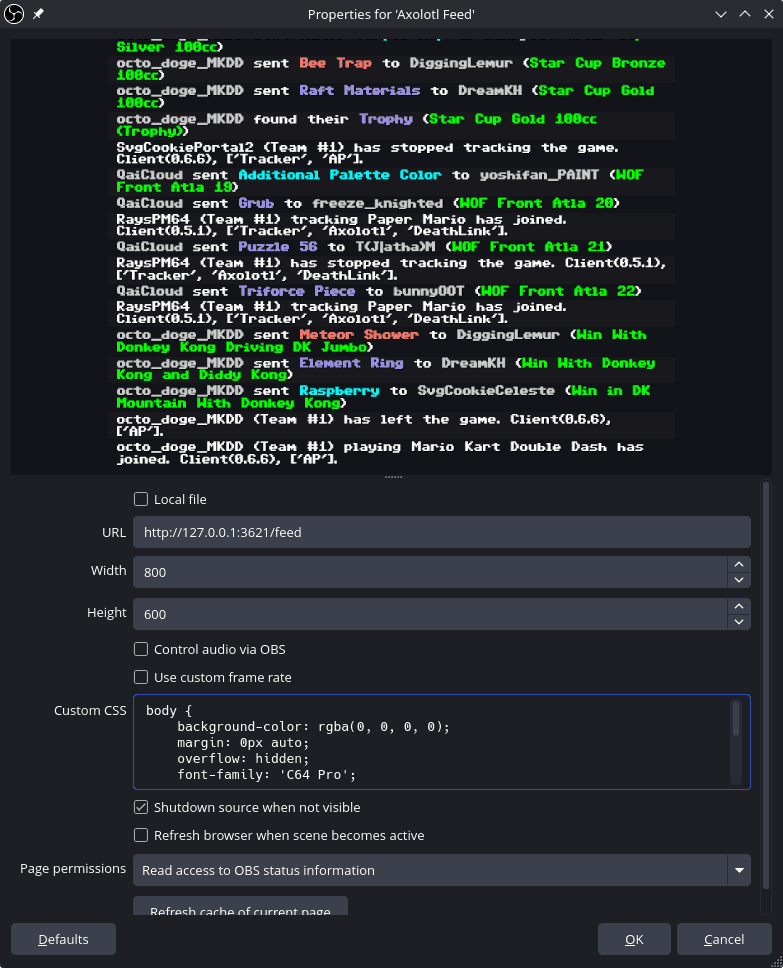

This is the CSS used in the example above:

```css
body {
    background-color: rgba(0, 0, 0, 0);
    margin: 0px auto;
    overflow: hidden;
    font-family: 'C64 Pro';
}

/* Remove the colorful left stripe from all feed items */
.feed-item {
    border-left: none !important;
}

/* Tighten the internal space (padding) and space between items (margin) */
.feed-item {
    padding: 2px 12px !important; /* Reduced from 8px to 2px */
    margin-top: 1px !important;   /* Reduced space between items */
}

/* Optional: Slightly reduce the font size for an extra compact feel */
.feed-text {
    font-size: 14px !important;
    line-height: 1.2 !important;
}

/* Style for every ODD event (1st, 3rd, 5th...) */
.feed-item:nth-child(odd) {
    background-color: rgba(30, 30, 35, 0.75) !important;
}
/* Style for every EVEN event (2nd, 4th, 6th...) */
.feed-item:nth-child(even) {
    background-color: rgba(20, 20, 25, 0.65) !important;
}

/* If you want to enable timestamps, remove the comment before display */
.timestamp {
    /* display: inline-block !important; /* Forces the timestamp to show */
    color: #dddddd;                  /* Subtle gray color */
    font-weight: normal;
    margin-right: 8px;               /* Space between timestamp and message */
}
```

### Overview Browser Source

This is served at `/overview`.

In order for it to display anything useful, you will need to open the Overview window in Axolotl, have the tracker URL (e.g. `https://archipelago.gg/tracker/iduWRXxiRt-geq9LZeP8vw`) filled in (in the Overview window's Tracker URL field), and be connected to at least one slot in the associated multiworld.

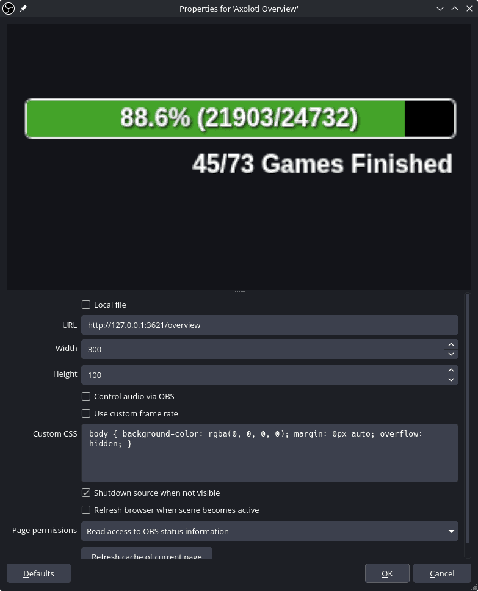

Similar to the item feed source, this source can be styled using CSS.  You can view the stock CSS in a browser at `http://127.0.0.1:3621/overview.css`.

Here are a few examples of CSS with various styling:

**Invert the order of the progress bar and the finished games:**
```css
#games-container { order: 1; }
#progress-container { order: 2; }
```

**Remove the "Games Finished" text but keep the numbers:**
```css
.games-label { display: none; }
```

**Get rid of the progress bar, keep the location counts, and show the games finished (numbers) on a single row**

```css
#progress-container { width: auto; }
#progress-bar-track { display: none; }
#progress-text { position: static; height: auto; justify-content: flex-start; }
#games-text { display: flex; flex-direction: row; gap: 8px; justify-content: flex-start; text-align: left; }
#overview-container { flex-direction: row; justify-content: flex-start;     gap: 20px; padding: 4px 12px; }
.games-label { display: none; }
```

### Graph Browser Source

This is served at `/graph`. It displays a line graph of location checks over time. The graph history is persisted across restarts.

Like the other sources, the graph requires a tracker URL to be configured and the Overview window to be syncing data.

This source is designed for use as an OBS Browser Source overlay. The background is transparent by default.

#### CSS Variables

The graph supports the following CSS custom properties, which can be set in the OBS Browser Source's **Custom CSS** field:

| Variable | Default | Description |
|----------|---------|-------------|
| `font-family` | `Segoe UI` | Font used for axis labels (set on `body`) |
| `--graph-line-color` | `rgba(75, 192, 192, 1)` | Color of the data line |
| `--graph-line-smoothing` | `0` | Line curve tension (`0` = sharp, `0.4` = smooth) |
| `--graph-show-x-labels` | `1` | Show time labels on X axis (`0` to hide) |
| `--graph-show-y-labels` | `1` | Show count labels on Y axis (`0` to hide) |
| `--graph-text-color` | `#fff` | Fill color of axis label text |
| `--graph-text-outline-color` | `#000` | Outline/stroke color around text |
| `--graph-text-outline-width` | `4` | Outline thickness in pixels |

#### Examples

**Change the line color to green, use Montserrat font, and add slight smoothing:**
```css
body {
    font-family: 'Montserrat', sans-serif;
    --graph-line-color: #047500;
    --graph-line-smoothing: 0.3;
}
```

**Hide all labels for a minimal line-only overlay:**
```css
body {
    --graph-show-x-labels: 0;
    --graph-show-y-labels: 0;
}
```

**Yellow text with a dark red outline:**
```css
body {
    --graph-text-color: #ffdd00;
    --graph-text-outline-color: #8b0000;
    --graph-text-outline-width: 3;
}
```

### Stats Browser Source

This is served at `/stats`. It rolls three independent overlays into a single page:

- **My slots** — progress bars for the slots this Axolotl client is connected to (or any slots named via `?players=`). Display as a stacked column, cycle one at a time, or always show only the slot that most recently sent a check. The bar fill follows the same red→yellow→green hue ramp as `/overview`, with `xx.x% (xxx/yyyyy)` overlaid in the bar.
- **Overall** — a multiworld progress bar (mirroring the legacy `/overview` content) plus a "X/Y games finished" counter. Same red→green hue ramp and bar styling as the per-slot rows.
- **Notable players** — a rotating callout that picks among _most ahead_ (highest checked/total ratio under 100%), _falling behind_ (lowest non-zero ratio), _most idle_ (longest silence past the idle threshold, displayed as live elapsed time like `10m0s` or `1d6h`), and a _not yet started_ counter. Categories that don't currently qualify are skipped, so the rotation only ever shows useful information.
- **Goal popup** — a celebratory animation (CSS-only fireworks + sparkles) that pops up whenever any player in the multiworld reaches their goal. By default it overlays the notable card while it's on screen; one Custom CSS line moves it over my-slots or overall instead.

The page is laid out as a CSS grid with three rows: `#my-slots` in row 1, `#overall` in row 2, and `#notable` in row 3. `#goal-popup` is placed in row 3 by default — it shares that cell with `#notable` and overlays it during a celebration. To overlay a different row, set `#goal-popup { grid-row: 1; }` (my-slots), `2` (overall), or `1 / -1` (whole stats area).

Hide any section you don't want via the `--stats-show-mine` / `--stats-show-overall` / `--stats-show-notable` CSS variables — e.g. `body { --stats-show-overall: 0; }`. These variables work in both stacked and unified layouts (in unified, they skip the matching cards from the rotation). The legacy `/overview` overlay remains available unchanged for existing setups.

When no client session is connected — initial page load before any slot connects, or after disconnecting all slots — a `#waiting` overlay covers the whole stats area with a "Waiting for connection…" message (customizable via `--label-waiting`). It hides automatically once any of the user's slots is connected.

The page has a dark background (`#1e1e24`) for desktop browsers — OBS overrides it to transparent via the default Custom CSS.

#### Query Parameters

| Param | Default | Description |
|---|---|---|
| `mine` | `all` | `#my-slots` display mode: `all` (stacked), `cycle` (rotate one at a time), or `latest` (show only the slot that most recently sent a check). |
| `players` | _(empty)_ | Comma-separated player names. When present, the "my slots" set uses these instead of the connected-slots default — useful for watching a friend's progress instead of your own. |
| `notable` | `ahead,behind,idle,not_started` | Which notable categories are eligible to appear in the rotation. |
| `showtop` | `1` | Number of "ahead" cards to expose. Default `1` shows just _Most ahead_; higher values add _2nd most ahead_, _3rd most ahead_, etc. as additional rotation cards. Behind / idle / not-started are unaffected. |
| `layout` | `stacked` | `stacked` (default) shows the three sections — `#my-slots`, `#overall`, `#notable` — as separate stacked regions. `unified` hides those and instead shows a single rotating region that walks through every card in order: each my-slot row, the overall card, and each qualifying notable card. The goal popup automatically expands to cover the whole stats area in unified mode. |

Example: `http://127.0.0.1:3621/stats?mine=cycle&notable=ahead,not_started`

#### CSS Variables

| Variable | Default | Description |
|---|---|---|
| `font-family` | `Segoe UI` | Set on `body`. |
| `--stats-bar-bg` | `rgba(0, 0, 0, 0.3)` | Notable-card background. |
| `--stats-text-color` | `#fff` | Body text. |
| `--stats-text-outline-color` | `#000` | Text outline (matches Graph). |
| `--stats-text-outline-width` | `4px` | Outline thickness. |
| `--stats-show-game` | `1` | Set to `0` to hide the game name on slot rows. |
| `--stats-show-percent` | `1` | Set to `0` to hide the percentage. |
| `--stats-show-counts` | `1` | Set to `0` to hide the `87/120` counts. |
| `--stats-show-mine` | `1` | Set to `0` to hide the my-slots section in stacked layout, and skip my-slot rows from the unified rotation. |
| `--stats-show-overall` | `1` | Same, for the overall card. |
| `--stats-show-notable` | `1` | Same, for the notable section. |
| `--stats-show-waiting` | `1` | Set to `0` to disable the "Waiting for connection…" overlay entirely (the page will be transparent until a connected snapshot arrives). |
| `--stats-mine-cycle-seconds` | `5` | Rotation interval for `?mine=cycle`. |
| `--stats-notable-cycle-seconds` | `7` | Rotation interval for the notable section. |
| `--stats-unified-cycle-seconds` | `5` | Rotation interval for `?layout=unified`. |
| `--stats-rotation-transition-seconds` | `0.4` | Duration of the entering/leaving animation when an item rotates. |
| `--stats-idle-threshold-seconds` | `600` | A slot is only eligible for the `idle` category once it's been silent this long. |
| `--stats-goal-duration` | `5s` | How long the goal popup stays on screen. |
| `--stats-goal-color` | `#4caf50` | Accent color for the player name in the popup text. |
| `--stats-goal-bg` | `#1e1e24` | Opaque background painted under the popup so the section beneath it doesn't bleed through. Set to `transparent` for an alpha-blended celebration over the live stats. |
| `--stats-goal-fireworks` | `1` | Set to `0` to disable the spark + sparkle layers (text-only popup). |
| `--stats-burst-palette` | `'#ff3b3b, #ff9d00, #ffeb3b, #4caf50, #2196f3, #ab47bc'` | Quoted, comma-separated list of colors. Each spark, mini-burst, and sparkle picks one at random. Each spark wave shares a single base color so they read as a coordinated burst, with ~25% of sparks rerolled to other colors for variety. |

#### Rotation Animations

The default rotation transition is a quick crossfade. `/stats.css` ships with two commented-out alternative presets at the bottom — _index-card slide-and-tuck_ and _horizontal slide_. To use one, copy its block from `/stats.css`, uncomment it, and paste it into your OBS browser source's Custom CSS field; that override beats the bundled default.

Each section has `overflow: hidden`, so any animation that escapes the section's bounding box is clipped (slide-style transitions won't bleed into adjacent OBS scene elements).

#### Previewing the Goal Popup

Real goals are rare, so styling the celebration is hard to iterate on. Type `/debug goal` into the in-app chat to fire a synthetic goal event:

- The currently selected slot (or the first connected session if none is selected) is used as the "player" — the popup shows your real player name and game so you can see what your audience would.
- The event is delivered straight to `/stats`'s `goal_event` channel and to the `/feed` overlay, but **not** through the network message handler — so chat history isn't touched and the slot isn't actually marked as completed in `/overview` or anywhere else.
- Run it as many times as you want while tweaking Custom CSS; the popup queue handles back-to-back triggers gracefully.

Requires at least one connected session; otherwise you'll see `[/debug goal] No connected slot to goal as.` in the chat.

#### Examples

**Goal popup only — hide the live stats sections, and let the popup fill the page:**
```css
body {
    --stats-show-mine: 0;
    --stats-show-overall: 0;
    --stats-show-notable: 0;
}
#stats-container { grid-template-rows: 1fr; }
#goal-popup { grid-row: 1; }
```

**Move the goal popup to overlay the my-slots column instead of the notable card:**
```css
#goal-popup { grid-row: 1; }
```

**Make the goal popup cover the whole browser source (useful when you're showing only one of `#my-slots` or `#notable` and want the celebration to fill the entire scene):**
```css
#goal-popup { grid-row: 1 / -1; }
```

**Override the bar fill with a flat color (instead of the red→yellow→green hue ramp):**
```css
.slot-bar-fill { background-color: #4caf50 !important; }
```

**Tighter rotations, no game names, gold goal accents:**
```css
body {
    --stats-mine-cycle-seconds: 3;
    --stats-notable-cycle-seconds: 4;
    --stats-unified-cycle-seconds: 3;
    --stats-show-game: 0;
    --stats-goal-color: #ffb300;
}
```
(`--stats-unified-cycle-seconds` only matters in `?layout=unified`; safe to leave in for stacked sources too.)

**Spotlight specific players' progress and pop up only on goals:**
```
http://127.0.0.1:3621/stats?players=Alice,Bob&mine=cycle
```
```css
body {
    --stats-show-overall: 0;
    --stats-show-notable: 0;
}
```

**Highlight your own slot rows in OBS:**
```css
.slot-row.is-mine .slot-name { color: #ffeb3b; }
```

**Single rotating region cycling through everything (slots, overall, notable):**
```
http://127.0.0.1:3621/stats?layout=unified
```

**Hide the overall card (keep my-slots and notable). Works in both layouts:**
```css
body { --stats-show-overall: 0; }
```

**Show only the overall card (works in both layouts):**
```css
body {
    --stats-show-mine: 0;
    --stats-show-notable: 0;
}
```

**Dedicated goal-popup browser source — fullscreen celebration with a lightly dimmed background (25% opacity), transparent the rest of the time.** Use `/stats` as a separate OBS browser source layered on top of your scene (no query params needed); set the Custom CSS below. All three stats sections are hidden, so the source is visually empty most of the time; when a goal fires, the popup spans the whole source and dims the scene behind it:
```css
body {
    --stats-show-mine: 0;
    --stats-show-overall: 0;
    --stats-show-notable: 0;
    --stats-goal-bg: rgba(30, 30, 36, 0.25);
}
/* Collapse the grid into a single row so the popup actually fills
   the browser source instead of being clipped to the (now-empty)
   default 3-row track sizes. */
#stats-container { grid-template-rows: 1fr; }
#goal-popup { grid-row: 1; }
```

#### Localizing Notable Card Labels

Each notable category title (the `MOST AHEAD:` / `FALLING BEHIND:` / `MOST IDLE:` / `NOT STARTED:` text) is read by JS from CSS variables at the moment a card is built, so OBS Custom CSS can replace the strings without touching the JS:

| Variable | Default | Used for |
|---|---|---|
| `--label-ahead-1` | `'Most ahead: '` | the rank-1 "ahead" card |
| `--label-ahead-n` | `'most ahead: '` | suffix appended after the ordinal on rank-2+ ahead cards. Full label = `<ordinal> ` + this. |
| `--label-behind` | `'Falling behind: '` | behind card |
| `--label-idle` | `'Most idle: '` | idle card |
| `--label-not-started` | `'Not started: '` | not-started card |
| `--label-overall` | `'Overall'` | leading label on the overall card (sits where a slot's name would go) |
| `--label-overall-suffix` | `'games finished'` | trailing summary text after the X/Y count on the overall card |
| `--label-waiting` | `'Waiting for connection…'` | text shown by the `#waiting` overlay when no client session is connected |

Example — Spanish labels:
```css
:root {
    --label-ahead-1: 'Más avanzado: ';
    --label-ahead-n: 'más avanzado: ';
    --label-behind: 'Más retrasado: ';
    --label-idle: 'Más inactivo: ';
    --label-not-started: 'No iniciado: ';
    --label-overall: 'Total';
    --label-overall-suffix: 'juegos terminados';
}
```

Note: the ordinal prefix on rank-2+ ahead cards (`2nd `, `3rd `, `122nd `, …) is generated in JS using English suffixes, so a layout that places the ordinal differently (e.g. French `2ème plus avancé`) will read awkwardly. For non-English deployments, the simplest path is `?showtop=1`.
